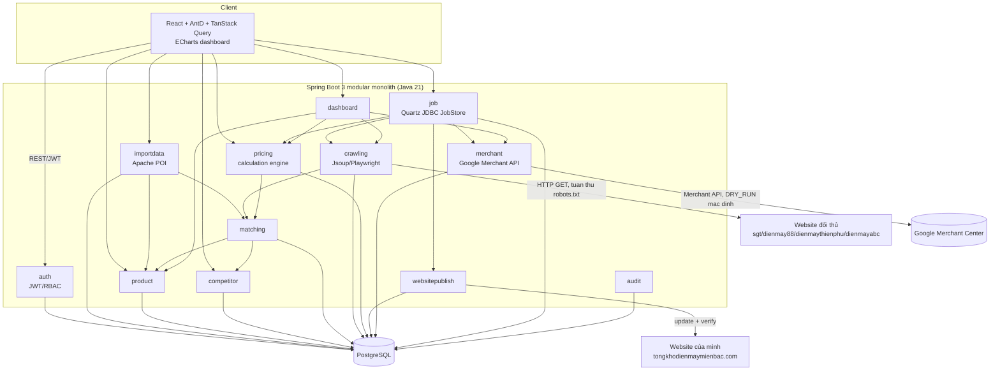
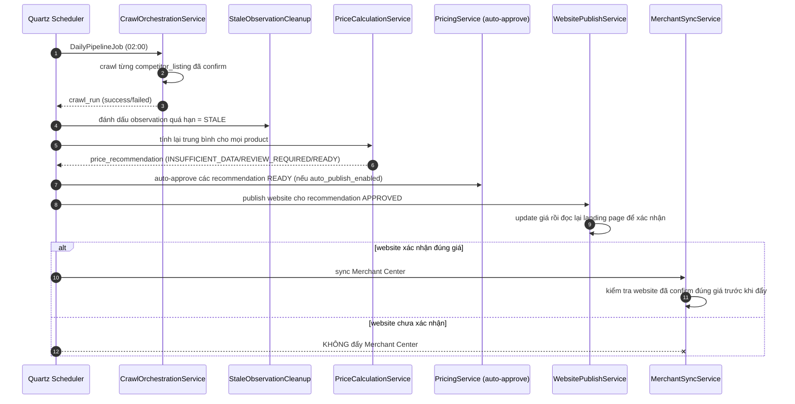

# Hệ thống tối ưu giá & đồng bộ Google Merchant Center — tongkhodienmaymienbac.com

Modular monolith quản trị giá sản phẩm: nhập feed Google Merchant Center, ghép sản phẩm với
website đối thủ, thu thập/nhập giá đối thủ, tính **giá đề xuất = trung bình cộng giá hợp lệ của
các đối thủ**, duyệt giá, cập nhật website rồi mới đồng bộ Google Merchant Center.

## 1. Kiến trúc tổng quan



## 2. Luồng dữ liệu chính (job tổng hằng ngày, 02:00 Asia/Ho_Chi_Minh)



## 3. Cây thư mục chính

```text
CPMAP/
├── backend/                         Spring Boot 3 (Java 21) modular monolith
│   ├── src/main/java/com/example/mcprice/
│   │   ├── auth/                    JWT, RBAC (ADMIN/ANALYST/OPERATOR)
│   │   ├── product/                 Product, ProductAlias, search/detail
│   │   ├── importdata/              Import Excel MC + báo cáo so sánh giá
│   │   ├── competitor/              CRUD website đối thủ
│   │   ├── matching/                Pipeline ghép sản phẩm, competitor_listings
│   │   ├── crawling/                StaticHtmlCrawler/BrowserCrawler/ManualOnlyCrawler
│   │   ├── pricing/                 Thuật toán tính giá, policy, recommendation
│   │   ├── websitepublish/          WebsitePricePublisher (Mock/WooCommerce)
│   │   ├── merchant/                MerchantCenterPublisher (Mock/Google API) + feed export
│   │   ├── job/                     Quartz jobs (JDBC JobStore) + trigger tay
│   │   ├── dashboard/               KPI & biểu đồ tổng hợp
│   │   ├── audit/                   Audit log cho mọi hành động nhạy cảm
│   │   ├── common/                  Util (SkuNormalizer, PriceParser, MoneyUtil...), exception, web
│   │   └── config/                  Security, Quartz, JPA auditing, CORS, OpenAPI
│   ├── src/main/resources/db/migration/   Flyway V1 schema, V2 seed reference, V3 seed demo
│   ├── src/test/java/...            Unit test + integration test (Testcontainers)
│   └── Dockerfile
├── frontend/                        React + TS + Vite + AntD + TanStack Query + ECharts
│   └── src/{api,components,pages,store}/
├── data/import/                     MC.xlsx và Bao_cao_so_sanh_gia_dien_may_*.xlsx
├── docs/data-analysis.md            Phân tích schema/thống kê hai file Excel thật
├── docker-compose.yml               postgres + backend + frontend
├── .env.example
└── .github/workflows/ci.yml         Build + unit test + integration test + docker compose smoke test
```

## 4. Chạy local bằng Docker Compose

```bash
cp .env.example .env
docker compose up -d --build
```

- Backend: http://localhost:8080 (Swagger UI: http://localhost:8080/swagger-ui.html)
- Frontend: http://localhost:3001
- PostgreSQL: expose ra host tại cổng `${DB_PORT:-15432}` (đổi trong `.env` nếu cổng 5432 đã dùng bởi service khác trên máy)

`docker-compose.yml` mount thư mục `data/import/` (read-only) vào `/app/data/import` trong
container backend để `ImportRefreshJob` có thể tự động quét và import lại khi phát hiện file mới.

### Đa ngôn ngữ (i18n)

Frontend dùng `react-i18next`, hỗ trợ **Tiếng Việt (mặc định)** và **English** ngay từ đầu. Toàn bộ
UI (menu, form, bảng, thông báo) đọc chuỗi từ `frontend/src/i18n/locales/{vi,en}.json` — không có
text hardcode trong component. Người dùng đổi ngôn ngữ qua dropdown ở góc phải header (hoặc màn hình
đăng nhập); lựa chọn được lưu vào `localStorage` và tự nhận diện theo ngôn ngữ trình duyệt lần đầu.
AntD (date picker, phân trang...) cũng đổi locale đồng bộ qua `LocaleProvider`. Muốn thêm ngôn ngữ
mới: tạo file JSON tương ứng trong `locales/`, đăng ký trong `src/i18n/index.ts` và thêm vào
`SUPPORTED_LANGUAGES`.

### Tài khoản demo (seed sẵn trong Flyway V2)

| Username | Password | Role |
|---|---|---|
| `admin` | `Admin@123` | ADMIN |
| `analyst` | `Analyst@123` | ANALYST |
| `operator` | `Operator@123` | OPERATOR |

## 5. Chạy test

```bash
cd backend
mvn test        # unit test (43 test) + integration test Testcontainers (cần Docker daemon chuẩn)

cd frontend
npm ci
npm test        # vitest (5 test suite)
npm run build   # kiểm tra build production
```

> Lưu ý môi trường: integration test dùng Testcontainers để dựng PostgreSQL thật. Nếu chạy `mvn test`
> bên trong một container Maven trên Docker Desktop for Windows, socket `/var/run/docker.sock` được
> mount vào có thể là proxy nội bộ của Docker Desktop chứ không phải Docker Engine API đầy đủ, khiến
> Testcontainers báo "Could not find a valid Docker environment". Chạy trực tiếp trên máy có Maven cài
> sẵn, trên Linux, hoặc trên GitHub Actions (đã cấu hình sẵn trong `.github/workflows/ci.yml`) thì
> không gặp vấn đề này — pipeline CI chạy toàn bộ 44 test (43 unit + 1 integration nhiều bước) thành công.
> Toàn bộ luồng nghiệp vụ mà integration test kiểm tra (import 2 file thật, nhập giá tay, tính trung
> bình, approve, publish dry-run, audit log) đã được xác nhận chạy đúng thủ công qua `docker compose`
> thật trong quá trình phát triển — xem mục 8 bên dưới.

## 6. Kết quả import hai file Excel thật (đã chạy kiểm chứng)

Sau khi `docker compose up`, import lần lượt qua UI (màn hình **Imports**) hoặc API:

```bash
TOKEN=$(curl -s -X POST http://localhost:8080/api/auth/login \
  -H "Content-Type: application/json" -d '{"username":"admin","password":"Admin@123"}' \
  | python -c "import json,sys; print(json.load(sys.stdin)['accessToken'])")

curl -X POST http://localhost:8080/api/imports/mc \
  -H "Authorization: Bearer $TOKEN" -F "file=@data/import/MC.xlsx"

curl -X POST http://localhost:8080/api/imports/comparison \
  -H "Authorization: Bearer $TOKEN" \
  -F "file=@data/import/Bao_cao_so_sanh_gia_dien_may_2026-07-29.xlsx"
```

Kết quả thực tế đo được khi chạy kiểm chứng trong quá trình phát triển:

| Chỉ số | Kỳ vọng (docs/data-analysis.md) | Thực tế đo được |
|---|---|---|
| Tổng dòng MC | 3.265 | 3.265 ✅ |
| MC thiếu `item_group_id` | 1.680 | 1.680 ✅ |
| Tổng dòng báo cáo so sánh giá | 2.128 | 2.128 ✅ |
| Báo cáo không tìm thấy trên web mình (`OWN_WEBSITE_NOT_FOUND`) | 1.303 | 1.303 ✅ |
| Dòng báo cáo ghép được với MC qua URL | 812/825* | 812 ✅ |
| Sản phẩm INSUFFICIENT_DATA ngay sau import | phần lớn (không đủ 2 nguồn) | 3.261/3.264 ✅ |
| Auto-publish ngay sau import | Không được phép | 0 recommendation PUBLISHED ✅ |

\* 812 khớp qua URL (đúng như phân tích: 812 URL "Tổng kho" duy nhất, khớp 100% với MC); 825 là số
liệu gốc đề bài tính cả 10 trường hợp "Nghi ngờ" theo tiêu chí khác — hệ thống ghi nhận đầy đủ cả hai
nhóm dưới dạng issue/trạng thái riêng biệt để người dùng xử lý, không gộp mù quáng.

Sau import, chạy tiếp luồng nghiệp vụ đầy đủ trên một sản phẩm thật có sẵn 1 nguồn giá đối thủ đã xác
minh (trong 10 giá số có sẵn từ file báo cáo):

1. `POST /api/products/{id}/manual-price` — nhập thêm giá đối thủ thứ 2 (mô phỏng nhân viên gọi điện
   xác nhận giá cho listing đang ở trạng thái "chưa có giá").
2. `POST /api/pricing/products/{id}/recalculate` — hệ thống tính đúng trung bình cộng 2 nguồn, làm
   tròn theo `rounding_step`.
3. `POST /api/recommendations/{id}/approve`.
4. `POST /api/publish/full-pipeline` — publish website (dry-run, `SUCCESS`) rồi mới sync Merchant
   Center (dry-run, `SUCCESS`); nếu website thất bại, Merchant Center chắc chắn không được gọi.
5. `audit_logs` ghi đầy đủ: `MANUAL_PRICE_ENTRY`, `PRICE_CALCULATE`, `RECOMMENDATION_APPROVE`,
   `WEBSITE_PUBLISH_DRY_RUN`, `MERCHANT_SYNC_DRY_RUN`.

Toàn bộ được lặp lại tự động trong `AcceptanceFlowIntegrationTest` (chạy trong CI).

## 7. Module đang dùng mock / cần credential thật để bật production

| Thành phần | Trạng thái hiện tại | Biến môi trường để chuyển sang thật |
|---|---|---|
| `MockWebsitePricePublisher` | Đang dùng mặc định (`WEBSITE_PUBLISHER_PROVIDER=MOCK`) | `WEBSITE_PUBLISHER_PROVIDER=WOOCOMMERCE`, `WOOCOMMERCE_ENABLED=true`, `WOOCOMMERCE_BASE_URL`, `WOOCOMMERCE_CONSUMER_KEY`, `WOOCOMMERCE_CONSUMER_SECRET` — yêu cầu Product có `externalId` = WooCommerce product ID |
| `MockMerchantCenterPublisher` | Đang dùng mặc định (`MERCHANT_PUBLISHER_PROVIDER=MOCK`) | `MERCHANT_PUBLISHER_PROVIDER=GOOGLE_API` **và** hoàn thiện `GoogleMerchantApiPublisher` (hiện là điểm nối sẵn sàng nhưng CHƯA tích hợp client thật — xem mục 9) |
| `DRY_RUN` cho website & Merchant | `true` (mặc định, không đổi khi chưa có credential thật) | `WEBSITE_DRY_RUN=false`, `MERCHANT_DRY_RUN=false` |
| `BrowserCrawler` (Playwright) | Có implement đầy đủ nhưng browser binary **chưa được cài** trong Docker image (không competitor demo nào dùng `BROWSER` mode) | Chạy `mvn exec:java -e com.microsoft.playwright.CLI install chromium` trong Dockerfile nếu cần bật crawl JS-heavy site |
| robots.txt checker | Basic (đọc `Disallow` cho `User-agent: *`) | Đủ dùng cho 4 domain seed sẵn; site phức tạp hơn có thể cần parser đầy đủ hơn |

## 8. Biến môi trường cần cấu hình để kết nối hệ thống thật

Xem đầy đủ trong `.env.example`. Các biến quan trọng nhất khi go-live:

```
WEBSITE_DRY_RUN=false
WEBSITE_PUBLISHER_PROVIDER=WOOCOMMERCE
WOOCOMMERCE_ENABLED=true
WOOCOMMERCE_BASE_URL=https://tongkhodienmaymienbac.com
WOOCOMMERCE_CONSUMER_KEY=...
WOOCOMMERCE_CONSUMER_SECRET=...

MERCHANT_DRY_RUN=false
MERCHANT_PUBLISHER_PROVIDER=GOOGLE_API
MERCHANT_ACCOUNT_ID=...
MERCHANT_DATA_SOURCE_ID=...
MERCHANT_CREDENTIALS_PATH=/run/secrets/merchant-service-account.json
```

Không có secret nào được hardcode trong mã nguồn — toàn bộ đọc từ biến môi trường qua `AppProperties`.

## 9. Rủi ro và việc còn cần làm thủ công

1. **`GoogleMerchantApiPublisher` chưa nối API thật.** Đã có interface, cấu hình, feature flag và
   fallback dry-run/mock đầy đủ, nhưng phần gọi Google Merchant API thật (OAuth/service account,
   Accounts/Products/DataSources) cần được bổ sung dependency chính thức + service account trước khi
   tắt `MERCHANT_DRY_RUN`. Cho đến lúc đó, dùng `GET /api/merchant/feed-export` để xuất lại file theo
   đúng schema `MC.xlsx` và upload thủ công qua Merchant Center.
2. **Chưa rõ CMS/API thật của website** nên `WebsitePricePublisher` mới có `Mock` + `WooCommerce`
   (behind feature flag). Nếu website dùng CMS khác, cần viết thêm 1 adapter implement cùng interface.
3. **`BrowserCrawler` (Playwright) chưa cài browser binary** trong image Docker hiện tại (không cần
   thiết cho 4 competitor seed sẵn — chỉ `dienmaythienphu.vn` được cấu hình `BROWSER` mode làm ví dụ).
   Cần thêm bước cài Chromium nếu có đối thủ mới thực sự cần crawl trang render bằng JavaScript.
4. **Fuzzy matching** hiện expose qua `ProductMatchingService.suggestFuzzyMatches(...)` ở tầng service,
   chưa có endpoint UI riêng để bấm "gợi ý ghép" hàng loạt — cần thêm nếu muốn giảm thao tác thủ công
   cho 1.303 sản phẩm "không tìm thấy" sau import.
5. **robots.txt checker** ở mức cơ bản (chỉ đọc `Disallow` cho `User-agent: *`), đủ cho 4 domain hiện
   tại nhưng nên rà soát lại điều khoản sử dụng của từng website đối thủ mới trước khi bật crawl thật.
6. Testcontainers integration test cần môi trường có Docker Engine API chuẩn (Linux CI, hoặc máy có
   Maven cài sẵn) — xem lưu ý ở mục 5.

## 10. Tài liệu liên quan

- [`docs/data-analysis.md`](docs/data-analysis.md): phân tích chi tiết schema và số liệu thật của hai
  file Excel đầu vào, làm cơ sở thiết kế importer/migration/test.
