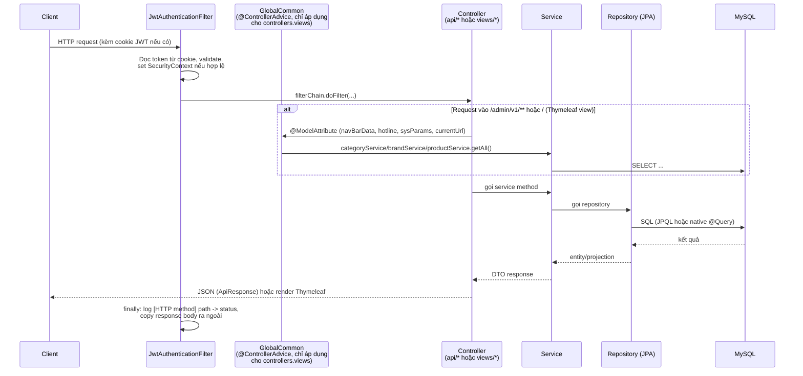
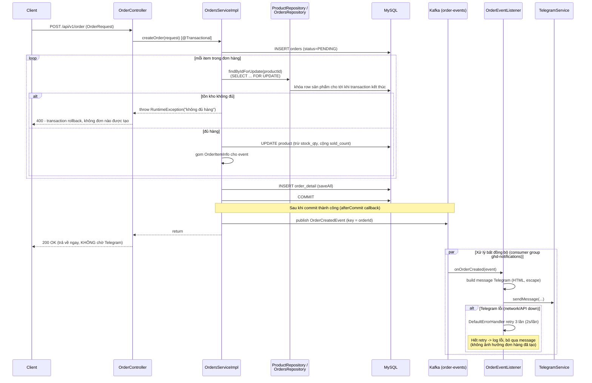
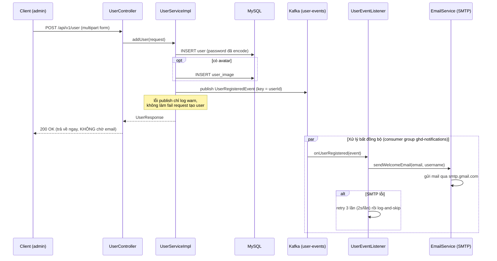
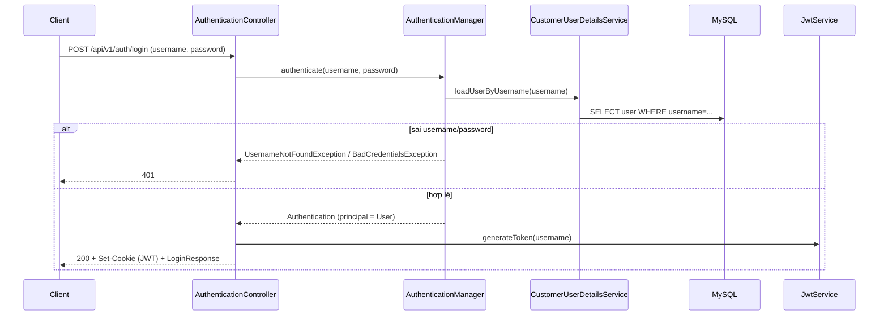

# Luồng xử lý của hệ thống (GHD)

Tài liệu này mô tả các luồng xử lý runtime chính của backend GHD: request đi qua những
lớp nào, luồng nghiệp vụ quan trọng (đặt hàng, đăng ký user) xử lý ra sao, và phần xử
lý bất đồng bộ qua Kafka được thêm vào ở đâu. Xem thêm `docs/PROJECT_INDEX.md` (cấu
trúc source code) và `docs/DOCKER.md` (vận hành Docker).

## 1. Luồng xử lý request chung

Ghi chú:

- `JwtAuthenticationFilter` chạy cho **mọi** request (`OncePerRequestFilter`), nhưng chỉ
  set `SecurityContext` nếu có cookie JWT hợp lệ - route công khai vẫn đi qua bình
  thường. Filter này cũng log request/response body (ẩn body nếu là HTML/Thymeleaf).
- `GlobalCommon` **chỉ** áp dụng cho `controllers.views` (`ViewAdminController`,
  `ViewClientController`) kể từ bản sửa gần nhất - trước đó nó là `@ControllerAdvice`
  không giới hạn phạm vi nên chạy cả trên API JSON (`controllers.api`), gây load thừa
  toàn bộ category/brand/product mỗi request và từng làm nhiễu một pessimistic lock (xem
  mục 2). Route `/api/v1/**` không còn bị ảnh hưởng bởi advice này.
- Các danh sách đọc nhiều/ít đổi (category, brand, banner, slider, policy, sys-param,
  product theo slug...) có `@Cacheable` vào Redis, xem `config/CacheConfig.java` để biết
  TTL từng cache.

## 2. Luồng đặt hàng (`POST /api/v1/order`)

Điểm quan trọng:

- **Chống oversell**: `findByIdForUpdate` khóa row sản phẩm bằng `FOR UPDATE` ngay
  trong transaction tạo đơn. Nếu 2 request đặt hàng cùng sản phẩm gần như đồng thời,
  request thứ hai phải đợi request thứ nhất commit xong mới đọc được tồn kho, nên luôn
  thấy đúng số lượng còn lại (không đọc phải giá trị cũ, không dùng optimistic-lock
  version conflict để chặn).
- **Không chờ Telegram**: trước đây `TelegramService.sendMessage(...)` được gọi trực
  tiếp trong `afterCommit`, tức là vẫn chạy đồng bộ trên thread xử lý request - client
  phải đợi Telegram API trả lời mới nhận response. Giờ `afterCommit` chỉ publish 1
  message JSON nhỏ lên Kafka (rất nhanh), còn việc gọi Telegram thật sự chuyển hẳn sang
  `OrderEventListener` chạy trên thread riêng của Kafka consumer.
- Lỗi ở bước gửi Telegram (kể cả sau khi hết retry) **không** rollback hay ảnh hưởng gì
  đến đơn hàng - đơn đã được lưu chắc chắn trước khi event được publish.

## 3. Luồng đăng ký user (`POST /api/v1/user`)

Trước đây `EmailService.sendWelcomeEmail` có `@Async` nhưng project không bật
`@EnableAsync` ở đâu cả, nên annotation này **vô hiệu** - gửi mail chạy đồng bộ
(SMTP handshake) ngay trong request tạo user. Giờ việc gửi mail chạy hẳn trong Kafka
consumer thread, tách khỏi request thread một cách thực sự.

## 4. Hạ tầng Kafka dùng chung cho 2 luồng trên

| | |
|---|---|
| Bootstrap servers | `localhost:9092` (chạy app ngoài Docker) / `kafka:19092` (app trong cùng docker network - internal listener) |
| Topics | `order-events`, `user-events` (1 partition/topic, đủ cho khối lượng hiện tại - xem comment trong `KafkaTopicConfig`) |
| Consumer group | `ghd-notifications` (dùng chung cho cả `OrderEventListener` và `UserEventListener`) |
| Serialization | Key: `StringSerializer`/`StringDeserializer`. Value: `JsonSerializer`/`JsonDeserializer` (Jackson 2, có sẵn qua `jjwt-jackson`) |
| Retry khi consumer lỗi | `KafkaConsumerConfig` - `DefaultErrorHandler` với `FixedBackOff(2000ms, 3 lần)`, hết retry thì log lỗi và bỏ qua message (không có dead-letter topic ở bản hiện tại) |
| File liên quan | `config/KafkaTopicConfig.java`, `config/KafkaConsumerConfig.java`, `events/*.java`, `listeners/*.java` |

Xem `docs/DOCKER.md` mục 12 để biết cách chạy Kafka qua Docker Compose và cách xem
message trong topic bằng `kafka-console-consumer`.

## 5. Luồng đăng nhập admin (`POST /api/v1/auth/login`)

Từ request tiếp theo, `JwtAuthenticationFilter` (mục 1) đọc cookie này, validate và set
`SecurityContext` cho mỗi request tới `/api/v1/**`/`/admin/v1/**` - session Thymeleaf
(Redis) chỉ dùng cho cookie `GHDSESSION` của phần view, tách biệt với cơ chế JWT.
